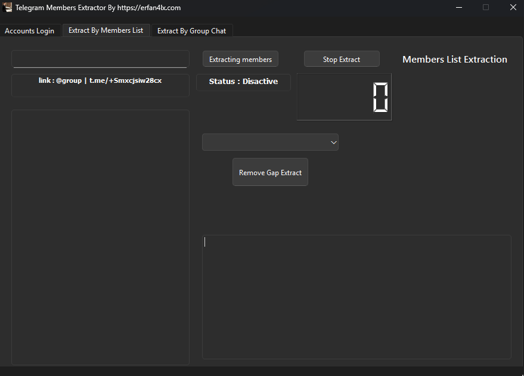

# Telegram Members Extractor 🧠
A free GUI tool to extract member lists from both regular Telegram groups and groups with hidden members.

---

## ✨ Features
- Accounts login & management
- Extract members by group link/username
- Extract members by group messages
- Live status & logs UI

## 🚀 Watch it on YouTube
[](https://www.youtube.com/watch?v=YOUR_VIDEO_ID)

> 🎥 Watch the full tutorial and demo of this project on my YouTube channel.


## 🚀 How to Use
```bash
pip install -r requirements.txt
python main.py
```

## 📦 Requirements
- Python 3.10+
- Windows 10/11 — Linux/Mac

## 📸 Preview 

---

## 💬 **Connect With Me**

👉 **Telegram:** [**https://t.me/erfan4lx10**](https://t.me/erfan4lx10)

🌐 **Website:** [**https://erfan4lx.com**](https://erfan4lx.com) 

📧 **Email:** [**erfan4lx@gmail.com**](mailto:erfan4lx@gmail.com)

---

🆔My YouTube Channel : https://youtube.com/erfan4lx

🆔My Telegram Channel : https://t.me/erfan4lx_news

<p align="center">
  Follow Me On
</p>
<p align="center">
  <a href="https://www.youtube.com/c/erfan4lx?sub_confirmation=1">
    
  </a>
</p>
